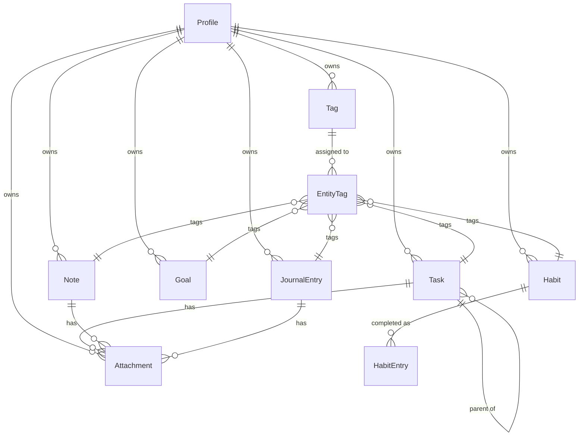

# DATA_MODEL.md

## Overview

Life OS uses a **universal entity pattern** — every entity in the system shares a common set of base properties. This ensures consistent sync behavior, audit tracking, and soft-delete support across all feature domains.

---

## Universal Entity Base

Every entity implements the `Entity` interface from `lib/core/data/entity.dart`:

### Base Properties

| Property | Type | Required | Description |
|----------|------|----------|-------------|
| `id` | `String` (UUID v4) | Yes | Universally unique identifier, generated client-side |
| `userId` | `String` | Yes | Owner's user ID (FK to auth.users) |
| `createdAt` | `DateTime` | Yes | Creation timestamp |
| `updatedAt` | `DateTime` | Yes | Last modification timestamp |
| `deletedAt` | `DateTime?` | No | Soft-delete timestamp (null = active) |
| `syncStatus` | `SyncStatus` | Yes | Current sync state |
| `version` | `int` | Yes | Monotonically increasing version for conflict detection |

### Sync Status Values

| Value | Description |
|-------|-------------|
| `synced` | Record is in sync with the remote server |
| `pendingPush` | Local changes waiting to be pushed |
| `pendingCreate` | New record created locally, needs initial push |
| `pendingPull` | Needs to be pulled from remote |
| `conflict` | Sync conflict detected, needs resolution |
| `failed` | Sync failed, will be retried |

---

## Entity Catalog

### 1. Profile

**Table**: `public.profiles` (Migration 001)  
**Feature**: `lib/features/profile/`  
**Description**: Extends Supabase auth.users. One profile per user, created automatically on sign-up.

| Field | Type | Notes |
|-------|------|-------|
| `id` | `UUID PK` | References auth.users(id) |
| `display_name` | `TEXT` | User's chosen name |
| `email` | `TEXT` | Mirrors auth.users.email |
| `avatar_url` | `TEXT` | Profile photo URL |
| `provider` | `TEXT` | 'email' or 'google' |

### 2. Task

**Table**: `public.tasks` (Migration 002)  
**Feature**: `lib/features/tasks/`  
**Description**: Actionable items with due dates, priority, and workflow status. Supports subtasks.

| Field | Type | Notes |
|-------|------|-------|
| `title` | `TEXT NOT NULL` | Task title |
| `description` | `TEXT` | Detailed description |
| `due_date` | `TIMESTAMPTZ` | When the task is due |
| `completed_at` | `TIMESTAMPTZ` | When the task was completed |
| `priority` | `INTEGER` | 0=none, 1=low, 2=medium, 3=high |
| `status` | `TEXT` | pending, in_progress, completed, archived |
| `parent_task_id` | `UUID FK` | Self-referencing for subtasks |
| `sort_order` | `REAL` | Manual ordering |

**Indexes**: user_id, status, due_date, parent_task_id, sync_status+updated_at

### 3. Note

**Table**: `public.notes` (Migration 002)  
**Feature**: `lib/features/notes/`  
**Description**: Free-form notes with pinning and color coding.

| Field | Type | Notes |
|-------|------|-------|
| `title` | `TEXT NOT NULL` | Note title |
| `content` | `TEXT` | Rich text / Markdown content |
| `is_pinned` | `BOOLEAN` | Pinned to top of list |
| `color` | `TEXT` | Hex color for visual grouping |
| `sort_order` | `REAL` | Manual ordering |

**Indexes**: user_id, is_pinned, sync_status+updated_at

### 4. Goal

**Table**: `public.goals` (Migration 002)  
**Feature**: `lib/features/goals/`  
**Description**: Long-term objectives with progress tracking (0.0 to 1.0).

| Field | Type | Notes |
|-------|------|-------|
| `title` | `TEXT NOT NULL` | Goal title |
| `description` | `TEXT` | Detailed description |
| `target_date` | `DATE` | Target completion date |
| `progress` | `REAL` | 0.0 to 1.0 |
| `status` | `TEXT` | active, completed, archived, paused |
| `category` | `TEXT` | Optional grouping category |
| `sort_order` | `REAL` | Manual ordering |

**Indexes**: user_id, status, target_date, sync_status+updated_at

### 5. Habit

**Table**: `public.habits` (Migration 002)  
**Feature**: `lib/features/habits/`  
**Description**: Recurring behaviors with frequency configuration.

| Field | Type | Notes |
|-------|------|-------|
| `name` | `TEXT NOT NULL` | Habit name |
| `description` | `TEXT` | Description |
| `frequency_type` | `TEXT` | daily, weekly, monthly, custom |
| `frequency_config` | `JSONB` | Flexible schedule config |
| `color` | `TEXT` | Hex color |
| `icon` | `TEXT` | Icon identifier |
| `target_count` | `INTEGER` | Target count per period |
| `is_archived` | `BOOLEAN` | Whether archived |
| `sort_order` | `REAL` | Manual ordering |

**Indexes**: user_id, active (user_id+is_archived+deleted_at), sync_status+updated_at

### 6. Habit Entry

**Table**: `public.habit_entries` (Migration 002)  
**Feature**: `lib/features/habits/`  
**Description**: Daily completion records for habits.

| Field | Type | Notes |
|-------|------|-------|
| `habit_id` | `UUID FK` | References habits(id) CASCADE |
| `completed_date` | `DATE NOT NULL` | Date of completion |
| `count` | `INTEGER` | Times completed on this date |
| `notes` | `TEXT` | Optional notes |

**Constraints**: UNIQUE(habit_id, completed_date)  
**Indexes**: user_id, habit_id+completed_date, sync_status+updated_at

### 7. Journal Entry

**Table**: `public.journal_entries` (Migration 002)  
**Feature**: `lib/features/journal/`  
**Description**: Timestamped personal journal entries with mood tracking.

| Field | Type | Notes |
|-------|------|-------|
| `title` | `TEXT` | Optional title |
| `content` | `TEXT NOT NULL` | Entry content |
| `mood` | `TEXT` | great, good, okay, bad, terrible |
| `entry_date` | `DATE NOT NULL` | Date of the entry |
| `is_favorite` | `BOOLEAN` | Starred / favorited |
| `location` | `TEXT` | Optional location |
| `weather` | `TEXT` | Optional weather |

**Indexes**: user_id, user_id+entry_date, user_id+mood, sync_status+updated_at

### 8. Tag

**Table**: `public.tags` (Migration 002)  
**Feature**: `lib/features/tags/`  
**Description**: Categorization labels, unique per user. Can be assigned to any entity.

| Field | Type | Notes |
|-------|------|-------|
| `name` | `TEXT NOT NULL` | Tag name |
| `color` | `TEXT` | Hex color |

**Constraints**: UNIQUE(user_id, name)  
**Indexes**: user_id, sync_status+updated_at

### 9. Entity Tags (Junction)

**Table**: `public.entity_tags` (Migration 002)  
**Feature**: Shared data layer  
**Description**: Many-to-many relationship between tags and entities (polymorphic).

| Field | Type | Notes |
|-------|------|-------|
| `tag_id` | `UUID FK` | References tags(id) CASCADE |
| `entity_type` | `TEXT NOT NULL` | 'task', 'note', 'goal', 'habit', 'journal_entry' |
| `entity_id` | `UUID NOT NULL` | The entity's ID |

**Constraints**: UNIQUE(tag_id, entity_type, entity_id)  
**Indexes**: entity_type+entity_id, user_id, sync_status+updated_at

### 10. Attachment

**Table**: `public.attachments` (Migration 002)  
**Feature**: `lib/features/attachments/`  
**Description**: Files linked to any entity (polymorphic relationship).

| Field | Type | Notes |
|-------|------|-------|
| `entity_type` | `TEXT NOT NULL` | 'task', 'note', 'journal_entry', 'goal' |
| `entity_id` | `UUID NOT NULL` | The parent entity's ID |
| `file_name` | `TEXT NOT NULL` | Original file name |
| `file_size` | `BIGINT` | Size in bytes |
| `mime_type` | `TEXT` | MIME type |
| `storage_path` | `TEXT NOT NULL` | Supabase Storage path |
| `thumbnail_path` | `TEXT` | Optional thumbnail |
| `is_uploaded` | `BOOLEAN` | Whether in cloud storage |
| `local_path` | `TEXT` | Local file path for offline |

**Indexes**: entity_type+entity_id, user_id, sync_status+updated_at

---

## Entity Relationships

---

## Design Principles

### 1. Client-Generated UUIDs

UUIDs are generated on the client, not the database. This enables:
- Offline creation without server round-trips
- Immediate UI feedback
- No ID conflicts across devices

### 2. Soft Deletes

Records are never physically deleted by default. The `deleted_at` timestamp marks records as deleted while preserving them for:
- Sync reconciliation
- Data recovery
- Audit trails

### 3. Optimistic Concurrency

The `version` field increments on every mutation. During sync, if the server's version is higher than the local version, a conflict is detected and the local record is marked for resolution.

### 4. Sync-Aware Queries

All queries should filter out soft-deleted records (`WHERE deleted_at IS NULL`) and respect sync status where appropriate.

### 5. Feature-First Organization

Each entity lives in its own feature directory with its own model, repository, and use cases. Entities do not import from other feature directories — cross-entity relationships are handled through repositories at the domain layer.

---

*Last updated: June 2025 — Milestone 3 completion.*