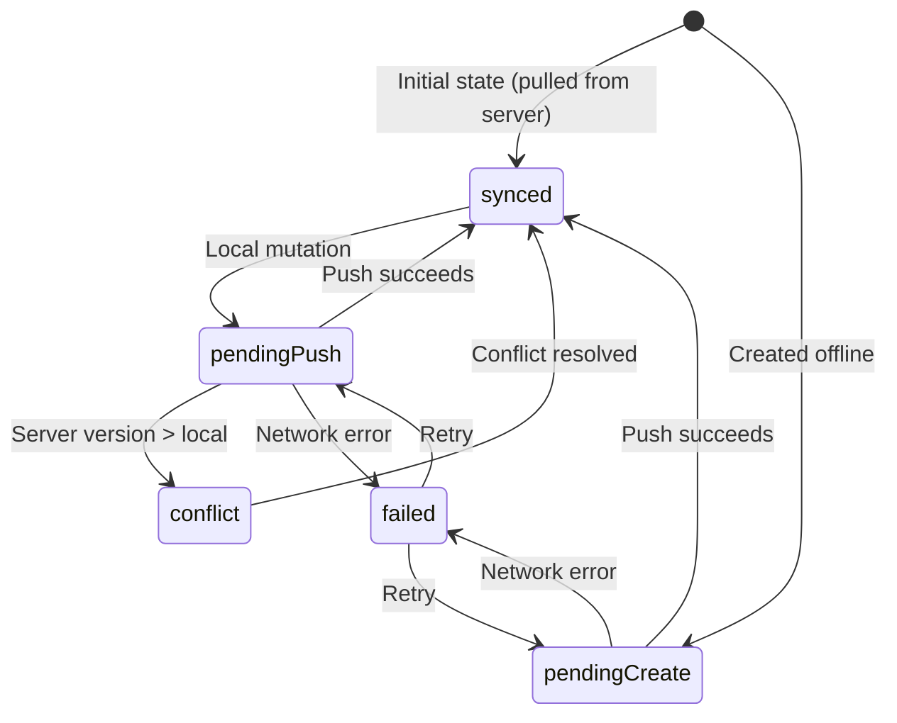

# Life OS Sync Engine — Design Document

This document describes the design of the Life OS sync engine. It covers the
pull, push, conflict detection, retry strategy, queue, and offline support
mechanisms. **This is a design document only — no implementation yet.**

---

## Architecture Overview

Life OS uses an **offline-first** architecture with **bidirectional sync**
between a local Drift (SQLite) database and a remote Supabase (PostgreSQL)
backend.

```
┌─────────────────┐         ┌─────────────────┐
│   Local Drift   │ ◄─────► │    Supabase     │
│   (SQLite)      │  Sync   │   (PostgreSQL)  │
└─────────────────┘         └─────────────────┘
```

Every entity carries a `syncStatus` field that the sync engine uses to
determine what needs to be pushed or pulled.

---

## Sync Status Lifecycle



---

## Pull Strategy

### Initial Pull (First Launch)

1. On first launch after authentication, query Supabase for all entities
   belonging to the user where `updated_at > last_sync_timestamp` (or all
   records if no prior sync).

2. Insert or upsert each record into the local Drift database with
   `syncStatus = synced`.

3. Store the `last_sync_timestamp` for the next incremental pull.

### Incremental Pull

1. Periodically (or on app foreground), query Supabase for records where
   `updated_at > last_sync_timestamp`.

2. For each remote record:
   - If the local record does not exist: insert with `syncStatus = synced`.
   - If the local record exists and `syncStatus == synced`: update the local
     record.
   - If the local record exists and `syncStatus != synced` (i.e., has pending
     local changes): compare versions to detect conflicts.

3. Update `last_sync_timestamp`.

### Pull Triggers

- App launch / foreground.
- Manual pull-to-refresh.
- Periodic background fetch (every 5–15 minutes, platform-dependent).
- Real-time Supabase subscription (WebSocket) for instant updates.

---

## Push Strategy

### Push Queue

Local mutations are not pushed immediately. Instead, they are queued:

1. When a local mutation occurs, the entity's `syncStatus` is set to
   `pendingPush` (or `pendingCreate` for new entities) and `version` is
   incremented.

2. A background sync worker picks up all records with
   `syncStatus == pendingPush || syncStatus == pendingCreate`.

3. Records are pushed in order of `updatedAt` (oldest first) to preserve
   causality.

### Push Execution

For each record in the queue:

1. **`pendingCreate`**: `INSERT` into Supabase. On success, set
   `syncStatus = synced`.

2. **`pendingPush`**: `UPDATE` in Supabase with a version check:
   ```sql
   UPDATE table SET ... WHERE id = $id AND version <= $localVersion
   ```
   - If the update affects 1 row: success. Set `syncStatus = synced`.
   - If the update affects 0 rows: the server has a newer version.
     Set `syncStatus = conflict`.

### Push Triggers

- After any local mutation (debounced by 2–5 seconds).
- On app background (best-effort, platform-limited).
- Manual "Sync Now" button.

---

## Conflict Detection & Resolution

### Detection

Conflicts are detected using **optimistic concurrency control** via the
`version` field:

- Every entity has a monotonically increasing `version` integer.
- On push, the server only applies the update if the local `version` is
  greater than or equal to the server's `version`.
- If the server's version is higher, the push is rejected and a conflict is
  flagged.

### Resolution Strategies

The sync engine will support multiple resolution strategies, configurable
per entity type:

| Strategy       | Behavior                                      |
| -------------- | --------------------------------------------- |
| **Last Write Wins (LWW)** | The most recent `updatedAt` wins.      |
| **Local Wins** | Local changes always overwrite remote.        |
| **Remote Wins**| Remote changes always overwrite local.        |
| **Manual**     | User is prompted to choose which version.     |

Default strategy: **Last Write Wins** for most entities, with the option to
configure per entity type or per conflict.

### Conflict Resolution Flow

1. When a conflict is detected, the entity's `syncStatus` is set to
   `conflict`.

2. Both versions (local and remote) are stored temporarily.

3. The resolution strategy is applied:
   - **LWW**: compare `updatedAt`, keep the newer one.
   - **Local/Remote Wins**: keep the chosen version.
   - **Manual**: present both versions to the user in the UI.

4. After resolution, the winning version is saved with `syncStatus = synced`
   and `version` set to `max(localVersion, remoteVersion) + 1`.

---

## Retry Strategy

### Exponential Backoff

Failed sync operations are retried with exponential backoff:

| Attempt | Delay        |
| ------- | ------------ |
| 1       | 1 second     |
| 2       | 4 seconds    |
| 3       | 9 seconds    |
| 4       | 16 seconds   |
| 5       | 25 seconds   |
| 6+      | 60 seconds   |

Maximum retry count: 10 attempts per record. After 10 failures, the record
is marked with `syncStatus = failed` and requires manual intervention.

### Jitter

A random jitter of ±25% is added to each delay to prevent thundering herd
problems when multiple records fail simultaneously.

### Connectivity Awareness

- The sync engine monitors network connectivity.
- When offline, sync is paused and all mutations remain queued locally.
- When connectivity is restored, sync resumes automatically.

---

## Offline Support

### Offline-First Design

The app is fully functional offline:

1. **Reads** always go to the local Drift database. Supabase is only used
   for sync, never for direct reads from the UI.

2. **Writes** are always applied locally first. The `syncStatus` is set to
   `pendingPush` or `pendingCreate`, and the sync engine pushes changes when
   connectivity is available.

3. **Conflict resolution** happens on the client side, ensuring the user
   always has a consistent view of their data.

### Offline Limitations

- **Attachments**: Files are stored locally and uploaded when online.
  `isUploaded = false` indicates a file that exists only locally.
- **Real-time collaboration**: Not supported offline. If two users modify the
  same entity while one is offline, conflicts are resolved on next sync.
- **Auth token refresh**: If the auth token expires while offline, the next
  sync will fail and require re-authentication.

---

## Sync Queue Design

### Queue Table (Future)

A dedicated `sync_queue` table may be introduced to track pending operations:

| Field        | Type       | Description                              |
| ------------ | ---------- | ---------------------------------------- |
| `id`         | `String`   | Queue entry ID.                          |
| `entityType` | `String`   | The type of entity (`task`, `note`, etc.).|
| `entityId`   | `String`   | The entity's ID.                         |
| `operation`  | `String`   | `create`, `update`, `delete`.            |
| `payload`    | `String`   | JSON-encoded entity data.                |
| `attempts`   | `int`      | Number of push attempts.                 |
| `lastError`  | `String?`  | Last error message.                      |
| `createdAt`  | `DateTime` | When the operation was queued.           |
| `nextRetryAt`| `DateTime?`| When to retry next.                      |

**Alternative (current approach):** Use the `syncStatus` field on each entity
directly, avoiding a separate queue table. The sync engine queries all entities
with `syncStatus != synced`. This is simpler but less efficient for large
datasets.

---

## Security Considerations

- **Row-Level Security (RLS)**: Supabase RLS policies ensure users can only
  access their own data (`user_id = auth.uid()`).

- **API Keys**: The Supabase anon key is used for all client-side requests.
  Admin operations require a backend service with the service role key.

- **Data Validation**: All data is validated client-side before local storage
  and server-side via PostgreSQL constraints.

---

## Performance Considerations

- **Batch operations**: Push and pull operations are batched (up to 50 records
  per request) to reduce network overhead.

- **Incremental sync**: Only changed records are synced, using `updated_at`
  timestamps and the `last_sync_timestamp` watermark.

- **Background processing**: Sync runs on a background isolate to avoid
  blocking the UI thread.

- **Throttling**: Sync is throttled to at most one push per 5 seconds and one
  pull per 30 seconds to avoid excessive API calls.

---

## Future Enhancements

1. **Delta sync**: Instead of sending full entity payloads, send only changed
   fields to reduce bandwidth.

2. **Compression**: Compress payloads for large sync batches.

3. **Selective sync**: Allow users to choose which entity types sync (e.g.,
   sync tasks but not journal entries).

4. **End-to-end encryption**: Encrypt sensitive entities (journal entries)
   before syncing to the server.

5. **Multi-device conflict resolution**: Enhanced conflict resolution UI for
   resolving conflicts across multiple devices.